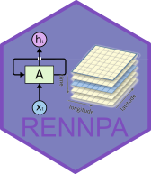

<!-- README.md is generated from README.Rmd. Please edit that file -->



# rennpa

<!-- badges: start -->

[](https://github.com/brazil-data-cube/rennpa/blob/master/LICENSE) [](https://rennpa.readthedocs.io/en/latest/) [](https://www.tidyverse.org/lifecycle/#stable) [](https://github.com/brazil-data-cube/rennpa/releases) [](https://pypi.org/project/rennpa/) [](https://discord.com/channels/689541907621085198#)

<!-- badges: end -->

## Overview

**RENNPA** or **RE**current **N**eural **N**etwork **P**ython **A**PI, is an Python package with a RNN ready for satellite image time series classification. 
The package
implements a number of functions to assist the proccess of production of land use and land cover maps based on time series, all based on the Brazil Data Cube image catalog.


## Installation

You can install `rennpa` using `pip`:

```bash
pip install git+https://github.com/GSansigolo/rennpa
```

## Quick Start

```python

```